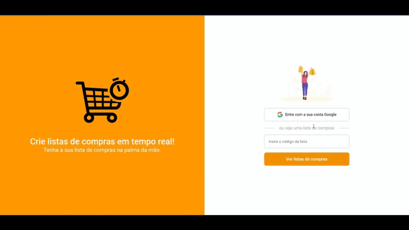

<p align="center">
  
</p>

<p align="center">
     
</p>

<h1 align="center">
    
</h1>

<br>

## 🧪 Tecnologias

Esse projeto foi desenvolvido com as seguintes tecnologias:

- [React](https://reactjs.org)
- [Firebase](https://firebase.google.com/)
- [TypeScript](https://www.typescriptlang.org/)

## 🚀 Como executar

Clone o projeto e acesse a pasta do mesmo.

```bash
$ git clone https://github.com/arthurfortunato/shoppingList.git
$ cd shopping-list
```

Para iniciá-lo, siga os passos abaixo:
```bash
# Instalar as dependências
$ yarn || npm install

# Iniciar o projeto
$ yarn start || npm start
```
O app estará disponível no seu browser pelo endereço http://localhost:3000.

Lembrando que será necessário criar uma conta no [Firebase](https://firebase.google.com/) e um projeto para disponibilizar um Realtime Database.

## 💻 Projeto

Shopping List é perfeito para criar listas de compras de uma forma muito organizada e rápida. 


## 📝 License

Esse projeto está sob a licença MIT. Veja o arquivo [LICENSE](LICENSE.md) para mais detalhes.

---